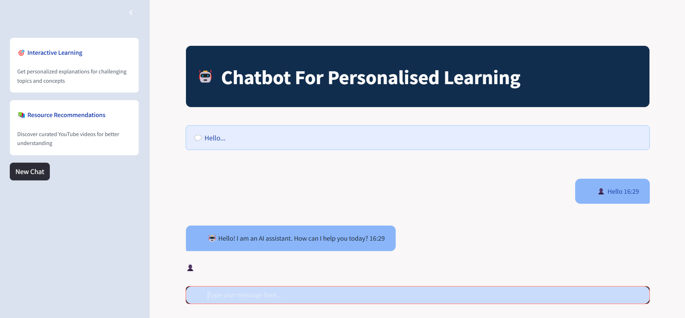
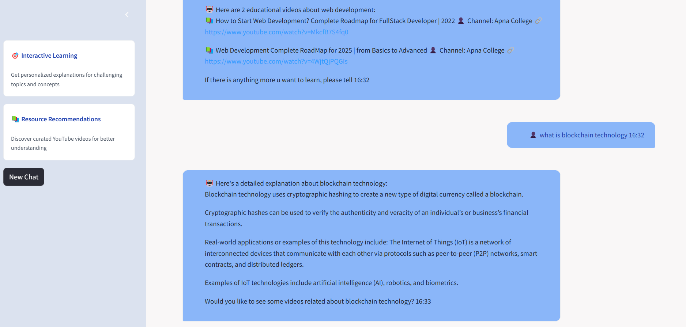
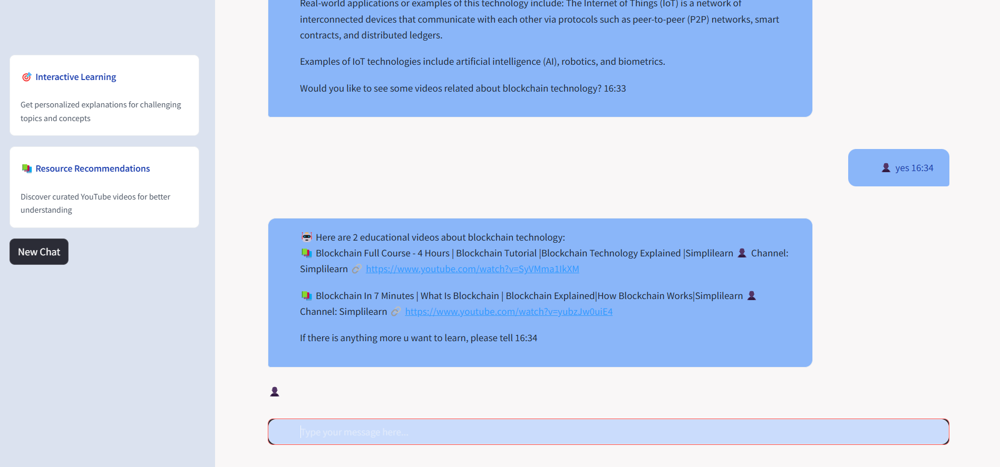

# 🤖 Chatbot for Personalized Learning

## 📝 Project Description
The **Chatbot for Personalized Learning** is an AI-powered assistant designed to enhance the learning experience. Using advanced machine learning models and APIs, the chatbot:
1. Generates content based on user queries
2. Recommends YouTube videos relevant to the topic

This chatbot aims to make learning interactive, engaging, and tailored to the user's needs.

## ⭐ Features
- 🧠 **Content Generation:** Utilizes Hugging Face's google/flan-t5-large model for generating detailed and accurate responses to user queries
- 🎥 **Video Recommendations:** Integrates YouTube API to provide curated video recommendations based on the user's query
- 🎯 **Personalized Learning:** Delivers customized educational resources and guidance tailored to individual users' needs
- 🔄 **Seamless LMS Integration:** Interacts with external educational repositories to provide topic-specific content
- 💡 **NLU-Driven Interactions:** Uses advanced Natural Language Understanding techniques for intelligent conversations

## 🛠️ Tech Stack
- 🐍 **Language:** Python
- 🤖 **Framework:** RASA for chatbot development
- 🧪 **Machine Learning:** Hugging Face Transformers (google/flan-t5-large)
- 📺 **APIs:** YouTube Data API v3
- 💻 **IDE:** Visual Studio Code
- 🚀 **Frontend:** Streamlit

## 📦 Modules Implemented
1. **Intent Recognition:** Advanced NLU for understanding user queries
2. **Dialogue Management:** Context-aware conversation handling
3. **LMS Integration:** Seamless connection with educational repositories
4. **Content Generation:** AI-powered response generation
5. **Video Recommendation:** Smart YouTube content curation

## ⚙️ Setup Instructions

### Prerequisites
- Python 3.8+
- Virtual Environment
- API Keys:
  - YouTube Data API key

### Installation Steps

1. **Clone the repository:**
```bash
git clone https://github.com/vermaaatul07/Chatbot_for_Personalized_Learning.git
cd Chatbot-for-Personalized-Learning
```

2. **Create and activate virtual environment:**
```bash
python -m venv venv
# For Windows
venv\Scripts\activate
# For Unix/MacOS
source venv/bin/activate
```

3. **Install dependencies:**
```bash
pip install -r requirements.txt
```

4. **Configure API keys:**
Create a `.env` file in the root directory:
```env
YOUTUBE_API_KEY=your_key_here
```

5. **Train RASA model:**
```bash
rasa train
```

## 🚀 Deployment

### Local Deployment with Streamlit

1. **Install Streamlit:**
```bash
pip install streamlit
```

2. **Run the Streamlit app:**
```bash
# Start RASA server
rasa run --enable-api --cors "*" --port 5005

# In a new terminal, start RASA actions
rasa run actions

# In another terminal, run Streamlit
streamlit run app.py
```

The application will be available at `http://localhost:8501`

### 🌐 Deployment Options
- **Local:** Run using Streamlit for development
- **Cloud:** Deploy to Streamlit Cloud for production
- **Docker:** Containerization available for scalable deployment

## 🎮 Usage Guide

1. **Starting a Conversation:**
   - Launch the Streamlit interface
   - Type your question in the chat input
   - Press Enter or click Send

2. **Getting Responses:**
   - View AI-generated content
   - Explore recommended YouTube videos
   - Follow up with related questions

3. **Example Interactions:**
```
User: "Explain quantum computing"
Bot: *Generates detailed explanation*
Bot: "Would you like to see some video resources?"
User: "Yes"
Bot: *Provides relevant YouTube links*
```
## Project Screenshots

### Image 1


### Image 2


### Image 3

## 📄 License
This project is licensed under the MIT License - see the [LICENSE](LICENSE) file for details.


